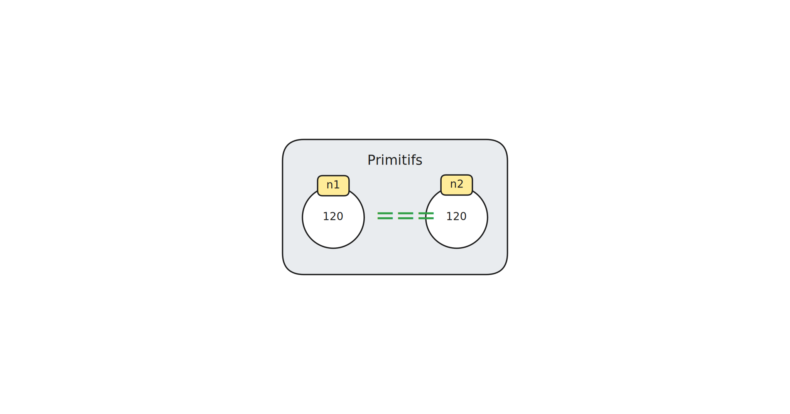
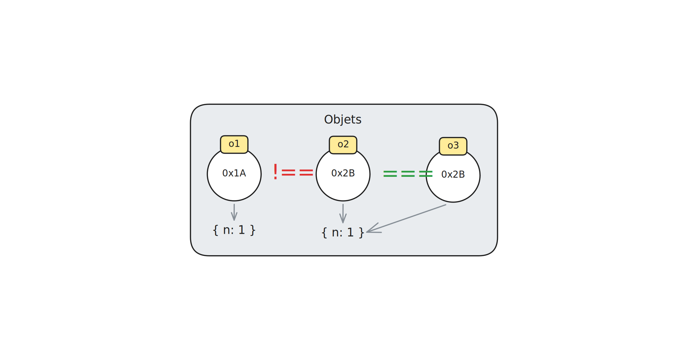

# Objets

Jusqu'à présent, nous avons travaillé uniquement avec des valeurs
primitives, lesquelles sont **atomiques**. Comme son nom l'indique, une
valeur atomique ne peut pas être décomposée en parties plus petites. On
peut diviser un nombre par un autre, ou obtenir le dernier caractère
d'une chaîne, mais dans les deux cas le type du résultat restera le même
qu'au départ.

Or, plusieurs informations du monde réel sont constituées d'autres
informations. Un compte en banque, par exemple, possède un numéro, un ou
une propriétaire, une balance courante, etc. Pour représenter ce genre
de situation dans nos programmes, il faut un type de valeur qui permet
de regrouper ces informations dans une seule et même structure. En
JavaScript, cette structure s'appelle un **object**.

Un objet est un ensemble de **propriétés**, chacune ayant un nom (aussi
appelé une **clé**) et une valeur. Le nom d'une propriété est une chaîne
de caractères, alors que sa valeur peut être de n'importe quel type. Une
propriété dont la valeur est une fonction est appelée une **méthode**.

> [!NOTE]
> Une méthode que vous connaissez bien est `log`, qui est une propriété
> de l'objet global `console`. Vous pouvez consulter les autres
> propriétés de `console` sur [MDN][console]. Pareillement, `toBe` est
> une méthode de l'objet retourné par la fonction `expect`.

La façon la plus simple de créer un objet est avec un **littéral
d'objet** :

```js
const kenAccount = {
    holder: "Ken Takakura",
    balance: 0,
    deposit: function(amount) {
        return kenAccount.balance += amount;
    },
};
```

Comme vous pouvez voir, un littéral d'objet est une liste de propriétés
délimitée par des accolades. Ci-dessus, l'objet affecté à l'identifiant
`kenAccount` a trois propriétés (`holder`, `balance`, `deposit`), dont
une est une méthode (`deposit`). Le nom de la propriété est à gauche des
`:`, tandis que sa valeur est à droite. Les propriétés sont séparées par
des virgules.

Pour accéder à la valeur d'une propriété, on utilise son **accesseur**.
Un accesseur correspond au nom de la propriété, précédé d'un point :

```js
console.log(kenAccount.holder); // => "Ken Takakura"
console.log(kenAccount.balance); // => 0
```

L'évaluation d'une expression comme `kenAccount.holder` est similaire à
l'évaluation d'une affectation. Au moment d'exécuter le programme,
l'interprétateur JavaScript remplace d'abord l'identifiant `kenAccount`
par l'objet vers lequel pointe celui-ci :

```
{ holder: "Ken Takakura", balance: 0, ... }.holder
```

Puis l'expression entière est substituée par la valeur de la propriété
(dans ce cas, `"Ken Takakura"`).

Notez que les objets sont indépendants les uns des autres. Deux objets
différents peuvent avoir une propriété qui porte le même nom, sans que
cela pose problème :

```js
const momoAccount = {
    holder: "Momo Ayase",
    balance: 10,
    deposit: function(amount) {
        return momoAccount.balance += amount;
    },
};

console.log(momoAccount.holder); // => "Momo Ayase"
console.log(kenAccount.holder); // => "Ken Takakura"
```

Quoique les accolades d'un littéral d'objet ne forment pas de bloc à
proprement dit, les propriétés d'un objet sont comme des variables
seulement accessibles à partir de l'objet dans lequel ces propriétés ont
été déclarées. C'est pouquoi la valeur de `momoAccount.holder` est
`"Momo Ayase"` tandis que le code ci-dessous produit une erreur :

```js
console.log(holder); // => ReferenceError: Can't find variable: holder
```

[console]: https://developer.mozilla.org/en-US/docs/Web/API/console#instance_methods

## Mutabilité et référence

Les valeurs primitives telles que les nombres, les chaînes et les
booléens sont **immuables** ; une fois créées, ces valeurs ne peuvent
pas être modifiées. Lorsqu'on additionne des nombres et qu'on concatène
des chaînes de caractères, les valeurs originales restent les mêmes.

```js
console.log("Java" + "Script"); // => "JavaScript"
```

Dans l'exemple ci-dessus, `"Java"`, `"Script"` et `"JavaScript"` sont
trois chaînes différentes. La concaténation des deux premières chaînes
donne une troisième, nouvelle chaîne, et ce, sans modifier les chaînes
originales.

Il en va autrement des objets. Puisqu'il est possible de réaffecter ses
propriétés, un même objet peut avoir des valeurs différentes à
différents moments de l'exécution du programme. Pour cette raison, on
dit que les objets sont **mutables**.

```js
console.log(kenAccount.balance); // => 0
kenAccount.balance = kenAccount.balance + 10;
console.log(kenAccount.balance); // => 10
```

Le code ci-dessus, par exemple, ne crée pas une nouvelle version de
l'objet ; la constante `kenAccount` pointe toujours vers le même objet.
Plutôt, l'objet original est _mis à jour_ lorsque la propriété `balance`
est réaffectée à la valeur actuelle de `balance` plus 10.

Cette caractéristique est d'autant plus importante que les objets sont
manipulés par **référence**, contrairement aux valeurs primitives qui le
sont par leur valeur. Prenons par exemple les valeurs `120` et `120`.
Dans un programme JavaScript, elles sont considérées comme étant égales
:

```js
const n1 = 120;
const n2 = 120;
console.log(n1 === n2); // => true
```



En revanche, deux objets ayant des propriétés et des valeurs identiques
ne sont pas considérés comme égaux :

```js
const o1 = { n: 1 };
const o2 = { n: 1 };
console.log(o1 === o2); // => false
```

Lorsqu'un objet est affecté à un identifiant, la valeur de l'affectation
n'est pas l'objet lui-même, comme c'est le cas pour les valeurs
primitives, mais plutôt son **adresse en mémoire**. Pour que des objets
soient égaux, ils doivent avoir la même adresse (c'est-à-dire la même
**identité**) :

```js
const o3 = o2;
console.log(o2 === o3); // => true
```

Dans l'exemple ci-dessus, les identifiants `o2` et `o3` pointent vers le
même objet en mémoire. Leur valeur est la même adresse, et c'est
pourquoi le résultat de l'opération `o2 === o3` est `true`.



De plus, comme les identifiants `o2` et `o3` pointent vers le même
objet, réaffecter la propriété `n` de `o2` mettra aussi à jour la
propriété `n` de `o3`, et vice versa :

```js
o2.n = 2;
console.log(o3.n); // => 2

o3.n = 3;
console.log(o2.n); // => 3
```

Puisque l'identifiant `o1` pointe vers un tout autre objet, il demeure
inchangé :

```js
console.log(o1.n); // => 1
```

JavaScript n'inclut pas d'opérateur ou de fonction pour déterminer si
deux objets différents ont les mêmes valeurs. Les opérateurs `==` (à
éviter) et `===` comparent tous deux l'identité des opérandes. Il en va
de même pour la méthode `toBe` utilisée pour les tests automatisés. Or,
comparer les valeurs de deux objets est souvent nécessaire pour valider
le fonctionnement d'une fonction. Pour ce faire, on utilise la méthode
`toEqual` :

```js
expect({ n: 1 }).toEqual({ n: 1 });
```

## Prototype

En plus d'avoir son propre ensemble de propriétés, un objet hérite
également des propriétés d'un objet parent appelé son **prototype**. Ce
prototype, qui est aussi un objet, possède son propre prototype, lequel
possède son prototype, et ainsi de suite de sorte à créer une **chaîne
de prototypes**. Le dernier maillon de la chaîne est toujours la valeur
`null`.

Lorsqu'on tente d'accéder à la valeur d'une propriété qui n'existe pas
sur un objet, l'interprétateur JavaScript remonte la chaîne de
prototypes jusqu'à trouver l'objet parent où la propriété est définie.
Si la propriété existe nulle part sur la chaîne de prototypes, alors sa
valeur est `undefined`.

L'objet littéral `{ n: 1 }`, par exemple, ne contient pas de propriété
`toString`. Or on peut tout de même y accéder puisqu'elle est définie
sur son prototype :

```js
console.log({ n: 1 }.toString()); // => "[object Object]"
```

On reviendra sur cette notion à la prochaine session. Pour l'instant, il
est suffisant de comprendre que certaines propriétés d'un objet sont
héritées d'un objet parent.

## Types d'objets

En JavaScript, `object` est un type de valeurs, tout comme `string` et
`number`. La valeur de l'expression `typeof { n: 1 }`, par exemple, est
`"object"` :

```js
console.log(typeof { n: 1 }); // => "object"
```

Mais on distingue aussi plusieurs _types_ d'objets selon les propriétés
qu'ils possèdent. Ainsi, le type `{ name: string }` regroupe tous les
objets qui ont une propriété `name` dont la valeur est une chaîne, et le
type `{ balance: number }` regroupe tous les objets qui ont une
propriété `balance` dont la valeur est un nombre.

Cette distinction entre les différents types d'objets est
particulièrement utile pour documenter l'interface des fonctions. La
fonction `getName` ci-dessous, par exemple, ne peut pas être appliquée
sur n'importe quel objet. Pour que la fonction retourne une chaîne, on
doit l'appliquer sur un objet ayant une propriété `name` dont la valeur
est une chaîne :

```js
/**
 * Returns the name of the given person object.
 * @param {{name: string}} person
 * @returns {string}
 */
function getName(person) {
    return person.name;
}

expect(getName({ name: "Bob" })).toBe("Bob");
expect(getName({ name: "Jinny" })).toBe("Jinny");
```

Dans ce cas, écrire `@param {objet} person` n'est pas assez précis, car
si l'objet `person` n'a pas de propriété `name`, alors la fonction ne
peut pas retourner le nom de la personne.

La plupart des objets ont des dizaines de propriétés, ce qui peut rendre
la documentation très verbeuse. Pour cette raison, on donne souvent un
nom aux types d'objets. Tous les objets de type `Date`, par exemple, ont
(entre autres) une méthode nommée `getFullYear` qui retourne l'année de
la date que l'objet représente.

Pour créer un objet de type `Date`, on utilise la fonction `Date`
précédée du mot-clé `new` :

```js
const nationalHoliday = new Date(2025, 5, 24);
console.log(nationalHoliday.getFullYear()); // => 2025
```

Une fonction telle que `Date`, qui permet de créer un objet d'un type
particulier, est appelée un **constructeur**. Nous verrons à la
prochaine session comment créer nos propres constructeurs. Pour
l'instant, nous nous contenterons d'utiliser ceux qui sont inclus avec
JavaScript.

Puisque `Date` est le nom d'un type, on peut l'utiliser pour documenter
l'interface des fonctions. Ainsi, la fonction `isBeforeNow` ci-dessous
détermine si une date donnée vient avant la date d'aujourd'hui :

```js
/**
 * Determines if the given date comes before now.
 * @param {Date} date
 * @param {Date} now
 * @returns {boolean}
 */
function isBeforeNow(date, now) {
    return date < now;
}

expect(isBeforeNow(new Date(2026, 5, 24), new Date(2026, 5, 25)))
    .toBe(true);
expect(isBeforeNow(new Date(2026, 5, 26), new Date(2026, 5, 25)))
    .toBe(false);
```

Vous remarquerez que le premier paramètre se nomme `date` (`d`
minuscule), tandis que son type est `Date` (`D` majuscule). Cette
convention est utilisée dans plusieurs langages de programmation. On
évitera donc de mettre en majuscule la première lettre de nos
affectations afin de ne pas mélanger valeur et type.
