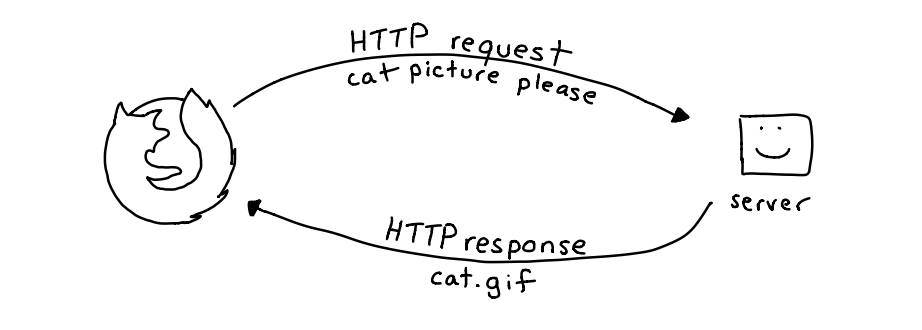
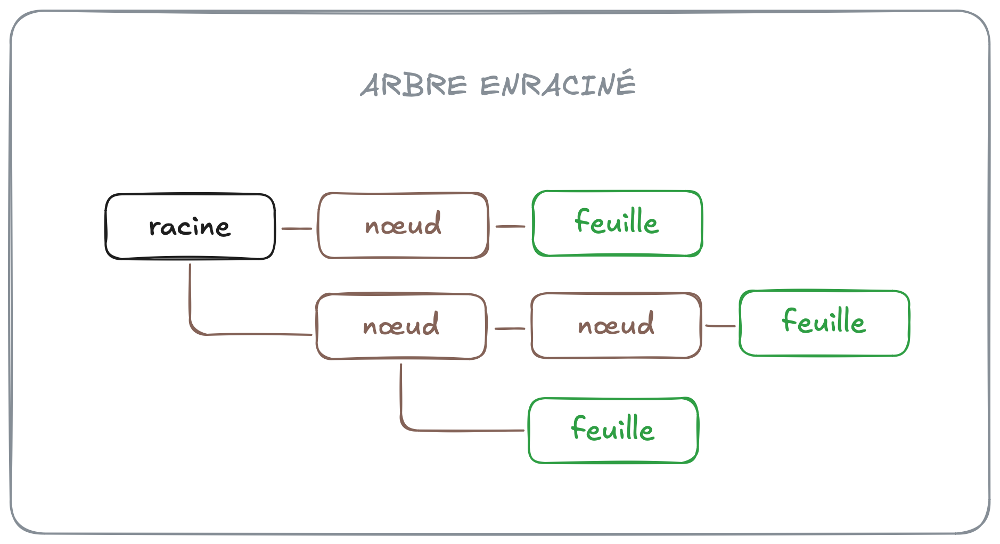
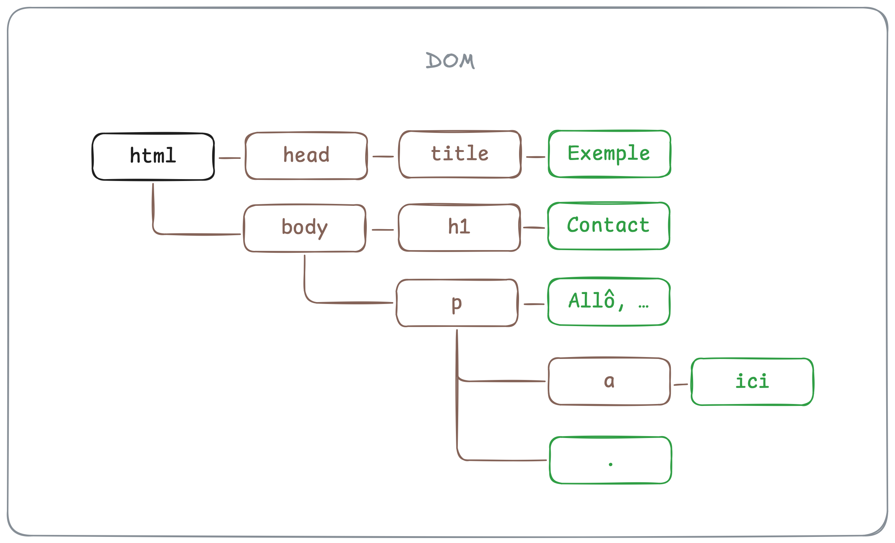

# Modèle objet de document

Lorsque vous entrez une adresse URL dans la barre de recherche d'un
navigateur (par exemple, `https://exemple.com/about/index.html`),
celui-ci envoie une **requête HTTP** au serveur qui correspond au **nom
de domaine** de l'adresse (`exemple.com`). Une requête HTTP est une
demande d'accès à une ressource spécifique identifiée par le **chemin**
de l'adresse URL (`/about/index.html`). Lorsqu'il reçoit la requête, le
serveur analyse celle-ci, puis renvoie une **réponse HTTP** qui contient
(ou non) la ressource demandée.



Si la ressource demandée est un document HTML, une feuille de style, un
script ou un module JavaScript, le contenu de la réponse sera sous forme
de **texte brut** (imaginez une longue chaîne de caractères). C'est la
tâche du navigateur d'_interpréter_ cette chaîne afin d'en permettre
l'affichage ou l'exécution.

Dans le cas d'un document HTML, le navigateur produit une représentation
en mémoire appelée **modèle objet de document**, ou **DOM** (_Document
Object Model_, en anglais). Le DOM est une structure de données qui
représente l'état _actuel_ d'une page. Avec JavaScript, on peut observer
ou modifier cette structure, et voir les changements s'afficher à
l'écran en temps réel.

> [!NOTE]
> Il est important de distinguer, d'une part, le document HTML, et de
> l'autre, le DOM. Le navigateur n'affiche pas le document HTML ; il
> affiche le DOM. Pareillement, JavaScript nous permet de manipuler le
> DOM, et non pas le document HTML.

Le DOM est un **arbre enraciné**, c'est-à-dire un graphe n'ayant pas de
circuit, possédant une seule racine, et dont tous les nœuds ont un seul
parent. Dans le domaine de la théorie des graphes, les éléments d'un
graphe sont appelés des **nœuds**. Les nœuds n'ayant pas d'enfant sont
appelés des **feuilles**, et un nœud n'ayant pas de parent est une
**racine**.



Dans le DOM, tous les éléments HTML sont des nœuds du graphe. Le graphe
comprend aussi des nœuds texte pour représenter le texte à l'intérieur
des éléments HTML, ainsi que des nœuds commentaire pour les commentaires
qui se trouvent dans le document.

Considérons par exemple le document HTML ci-dessous :

```html
<!DOCTYPE html>
<html>
    <head>
        <title>Exemple</title>
    </head>
    <body>
        <h1>Contact</h1>
        <p>
            Allô, mon nom est Marijn. Vous pouvez me contacter
            <a href="/exemple">ici</a>
            .
        </p>
    </body>
</html>
```

On pourrait représenter celui-ci avec l'arbre enraciné suivant :



Notez que les nœuds texte (et les nœuds commentaire) sont toujours des
feuilles. Seuls les nœuds élément peuvent avoir des enfants.

Cette [page Web] vous permet de visualiser le DOM de différents
documents HTML.

[page Web]: https://bioub.github.io/dom-visualizer/

## Traverser le DOM avec JavaScript

En JavaScript, on accède au DOM à partir de l'identifiant global
`document`, lequel pointe vers un objet de type `Document`. La propriété
`documentElement` de `document` pointe vers un objet qui représente le
nœud racine du document. Normalement, celui-ci est l'élément `<html>` :

```js
const root = document.documentElement;
console.log(root); // => <html>...</html>
```

Quoique la console du navigateur affiche les nœuds comme si c'était des
chaînes de caractères, ce n'est pas le cas. Un nœud est toujours un
objet. L'affectation `root` ci-dessus, par exemple, pointe vers un objet
de type `HTMLElement`. Il existe d'ailleurs des types d'objet pour
représenter la plupart des éléments HTML : `HTMLParagraphElement`,
`HTMLInputElement`, `HTMLTableElement`, etc. Vous pouvez utiliser ces
types pour documenter vos fonctions.

Les objets qui représentent les nœuds du DOM ont des propriétés qui
pointent vers les autres nœuds auxquels ils sont connectés. On peut
ainsi traverser le DOM, et éventuellement modifier la structure de
celui-ci. Vous trouverez ci-dessous quelques-unes de ces propriétés.

### childNodes et children

La propriété `childNodes` d'un nœud élément est une collection
`NodeList` contenant tous ses nœuds enfant, incluant les nœuds texte et
commentaire :

```js
const rootChildNodes = document.documentElement.childNodes;
console.log(rootChildNodes); // => NodeList [<head>, #text "\n", <body>]
```

La propriété `children` est similaire, mais elle inclut seulement les
nœuds élément :

```js
const rootChildElements = document.documentElement.children;
console.log(rootChildElements); // => NodeList [<head>, <body>]
```

Les objets de type `NodeList` sont similaires aux tableaux. On peut
accéder aux éléments d'une `NodeList` avec la notation entre crochets,
et on peut itérer sur ceux-ci avec une boucle `for..of`. Certaines
méthodes propres aux tableaux telles que `concat` et `slice` ne sont
toutefois pas accessibles sur les objets `NodeList`. On utilise la
fonction `Array.from` pour convertir une `NodeList` en `Array`.

### parentNode

La propriété `parentNode` d'un nœud pointe vers son nœud parent :

```js
const root = document.body.parentNode;
console.log(root); // => <html>...</html>
```

> [!NOTE]
> La propriété `body` de `document` se réfère toujours à l'élément HTML
> `<body>`.

Si le nœud est la racine du document, alors la valeur de `parentNode`
est `null` :

```js
console.log(root.parentNode); // => null
```

### firstChild et lastChild

Les propriétés `firstChild` et `lastChild` d'un nœud élément pointent
respectivement vers son premier et dernier nœud enfant :

```js
console.log(root.firstChild); // => <header>...</header>
console.log(root.lastChild); // => <body>...</body>
```

### previousSibling et nextSibling

Les propriétés `previousSibling` et `nextSibling` d'un nœud pointent
respectivement vers le nœud précédent et suivant ayant le même nœud
parent :

```js
console.log(document.header.nextSibling); // => <body>...</body>
console.log(document.body.previousSibling); // => <header>...</header>
```

## Chercher des nœuds

Quoiqu'il soit pratique de savoir traverser le DOM, on cherche souvent à
obtenir la référence d'un nœud en particulier. Dans ce cas, il n'est pas
conseillé d'utiliser les propriétés ci-dessus. On utilisera plutôt des
méthodes conçues spécifiquement pour chercher un ou plusieurs nœuds.

Il existe une panoplie de méthodes pour chercher un nœud dans le DOM. On
se concentrera ici sur deux seules : `querySelector` et
`querySelectorAll`. Libre à vous d'expérimenter avec d'autres, mais
celles-ci sont généralement suffisantes.

### querySelector

La méthode `querySelector` retourne un objet qui représente le _premier_
élément correspondant au sélecteur CSS donné comme argument :

```js
const e1 = document.querySelector("h1 + p"); // <p> suivant directement un <h1>
const e2 = document.querySelector("#foo"); // élément avec l'id foo
const e3 = document.querySelector(".bar span"); // premier <span> dans le premier élément avec la classe bar
```

La méthode `querySelector` peut être appelée à partir de l'objet global
`document` (auquel cas tout le document sera cherché), ou à partir d'un
élément en particulier (auquel cas la recherche sera limitée aux nœuds
enfant dudit élément) :

```js
const e4 = e1.querySelector("a"); // premier <a> dans e1
```

### querySelectorAll

La méthode `querySelectorAll` est identique à `querySelector`, hormis le
fait qu'elle retourne un objet `NodeList` qui contient _tous_ les
éléments correspondant au sélecteur CSS donné :

```js
const bodyChildElements = document.querySelectorAll("body > *"); // tous les enfants directs de <body>
console.log(bodyChildElements); // => NodeList [<h1>, <p>]
```

## Tester avec le DOM

Accéder au DOM constitue un effet de bord puisque le DOM représente un
état _externe_ à notre programme JavaScript. Par conséquent, une
fonction dont le corps se réfère directement à l'objet `document` ne
peut pas être testée facilement.

La fonction `hasP` ci-dessous, par exemple, détermine si le document
HTML contient un élément paragraphe :

```js
/**
 * Determines if there's a paragraph element in the document.
 * @returns {boolean}
 */
function hasP() {
    return document.querySelector("p") !== null;
}
```

Cette fonction est _impure_ car elle ne retourne pas toujours le même
résultat pour les mêmes arguments. On ne peut pas valider son
fonctionnement à l'aide de tests automatisés puisque sa valeur de retour
dépend du document HTML qui invoque le script.

Pour cette raison, si votre fonction doit accéder au DOM, mieux vaut lui
passer un nœud en argument :

```js
/**
 * Determines if the given parent has a child paragraph element.
 * @param {HTMLElement} parent
 * @returns {boolean}
 */
function hasP(parent) {
    return parent.querySelector("p") !== null;
}

test("should return true if parent has a paragraph child", () => {
    const body = document.createElement("body");
    expect(hasP(body)).toBe(false);

    body.append(document.createElement("p"));
    expect(hasP(body)).toBe(true);
});
```

Cette deuxième version de `hasP` prend un nœud élément en argument, ce
qui nous permet de tester la fonction avec un nœud qui n'a pas d'enfant
paragraphe, et un nœud qui en a un. Le résultat de ces tests dépend
seulement de la valeur de `parent`.

La fonction `test` sert à regrouper le code pour un cas de test. Elle
prend deux arguments : une chaîne qui décrit le résultat attendu, et une
fonction de rappel.
