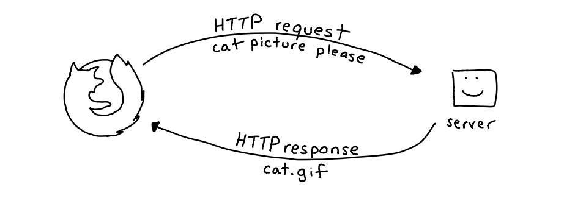
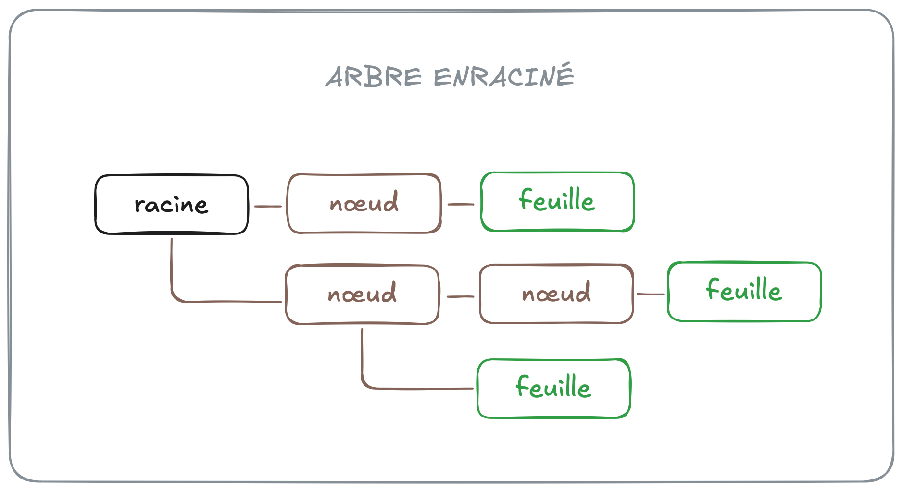
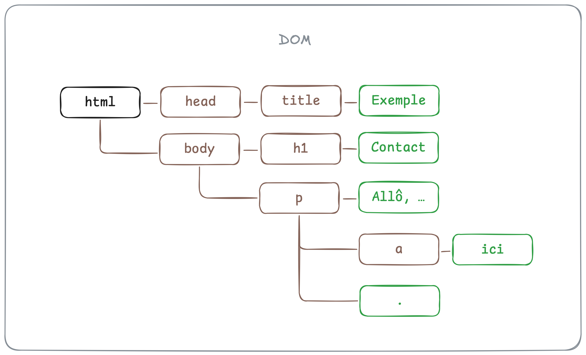

# Modèle objet de document

Lorsque vous entrez une adresse URL dans la barre de recherche d'un
navigateur, celui-ci envoie une requête HTTP au serveur qui correspond
au nom de domaine de l'adresse (`exemple.com`). Une requête HTTP est une
demande d'accès à une resource spécifique identifiée par le chemin de
l'adresse URL (`/about/index.html`, par exemple). Lorsqu'il reçoit la
requête, le serveur analyse celle-ci, puis renvoie une réponse HTTP qui
contient (ou non) la ressource demandée.



Peu importe le type de ressource (document HTML, feuille de style CSS,
script JavaScript, images, etc.), une réponse HTTP contient seulement du
texte brut. C'est la tâche du navigateur d'*interpréter* ce texte. Si le
contenu d'une réponse est un document HTML, le navigateur construit une
représentation structurée du document qui permet d'afficher la page à
l'écran, et de la manipuler avec des programmes. Cette représentation
s'appelle le *modèle objet de document*, ou *DOM* (*Document Object
Model*).

Le DOM est une structure de données qui représente l'état *actuel* d'une
page. Avec JavaScript, on peut observer ou modifier cette structure, et
voir les changements s'afficher à l'écran en temps réel.

## Arbre enraciné

Le modèle objet de document utilise une structure de données
particulière appelée « arbre enraciné » ou « arborescence ». Un arbre
enraciné est un type de graphe n'ayant pas de circuit, possédant une
racine unique, et dont tous les nœuds ont un seul parent. 

Dans le domaine de la théorie des graphes, on appelle « nœuds » les
éléments du graphe, « feuilles » un nœud n'ayant pas d'enfant, et 
« racine » un nœud n'ayant pas de parent. 



Concrètement, tous les éléments d'un document HTML est représenté par un
nœud du graphe. Il existe également des nœuds texte pour le texte à
l'intérieur des éléments HTML, ainsi que des nœuds commentaire pour les
commentaires qui se trouvent dans le document HTML.

Considérons par exemple le document HTML ci-dessous :

```html
<!DOCTYPE html>
<html>
    <head>
        <title>Exemple</title>
    </head>
    <body>
        <h1>Contact</h1>
        <p>
            Allô, mon nom est Marijn. Vous pouvez me contacter
            <a href="/exemple">ici</a>
            .
        </p>
    </body>
</html>
```

On pourrait représenter celui-ci avec l'arbre enraciné suivant :



Vous remarquerez que les feuilles sont toujours des nœuds texte (ou des
nœuds commentaire), alors que les nœuds élément ont toujours des
enfants.

## Accéder au DOM

En JavaScript, les nœuds du DOM sont représentés par des objets auxquels
on peut accéder à partir de l'identifiant global `document`. La
propriété `documentElement` de `document`, par exemple, est un objet qui
représente la racine du document. Normalement, la racine d'un document
HTML est un élément `html`.

```ts
const root = document.documentElement;
console.log(root); // => <html>...</html>
```

Attention, bien que la plupart des navigateurs afficheront ce qui peut
ressembler à une chaîne de caractère, la valeur de `root` ci-dessus est
un objet. Vous pouvez utiliser l'opérateur `typeof` pour vérifier que
c'est bien le cas.

```ts
console.log(typeof root); // => "object"
```

## Types de nœud

Chaque objet nœud du DOM a une propriété nommée `nodeType` dont la
valeur numérique correspond au type du nœud en question. Les nœuds qui
représente des éléments HTML sont de type `1`, les nœuds texte sont de
type `3`, et les nœuds commentaire sont de type `8`. Les constantes
`Node.ELEMENT_NODE`, `Node.TEXT_NODE` et `Node.COMMENT_NODE`
correspondent aux différents types.

```ts
console.log(root.nodeType); // => 1
console.log(root.nodeType === Node.ELEMENT_NODE); // => true
```

## Traverser le DOM

Les nœuds du DOM ont plusieurs propriétés qui pointent vers les autres
nœuds auxquels ils sont connectés. Accéder à ces propriétés permet de
traverser le DOM avec JavaScript.

### childNodes et children

La valeur de la propriété `childNodes` d'un nœud élément est une
référence à tous ses nœuds enfant, incluant les nœuds texte et
commentaire. La valeur de la propriété `children` est similaire, mais
inclue seulement les nœuds éléments.

```ts
const rootChildNodes = document.documentElement.childNodes;
console.log(rootChildNodes);    // => NodeList [<head>, #text "\n", <body>]

const rootChildElements = document.documentElement.children;
console.log(rootChildElements); // => NodeList [<head>, <body>]
```

À la différence des autres propriétés ci-dessous, la valeur de
`childNodes` et de `children` n'est pas un nœud, mais plutôt est un
objet de type `NodeList` qui représente plusieurs nœuds. Les objets
`NodeList` sont similaires à des tableaux (quoique techniquement ils ne
sont pas des tableaux). On peut accéder aux éléments d'une `NodeList`
avec la notation entre crochets, et on peut itérer sur ceux-ci avec une
boucle `for..of`. Certaines méthodes propres aux tableaux telles que
`concat` et `slice` ne sont toutefois pas accessibles sur les objets
`NodeList`.

### parentNode

La valeur de la propriété `parentNode` d'un nœud est une référence à son
nœud parent. Si le nœud est la racine du document, alors la valeur de
`parentNode` est `null`.

```ts
const root = document.body.parentNode;
console.log(root); // => <html>...</html>
```

La propriété `body` de `document` se réfère toujours à l'élément HTML
`body`.

### firstChild et lastChild

La valeur des propriétés `firstChild` et `lastChild` d'un nœud élément
est respectivement une référence à son premier et dernier nœud enfant.

```ts
console.log(root.firstChild); // => <header>...</header>
console.log(root.lastChild;   // => <body>...</body>
```

### previousSibling et nextSibling

La valeur des propriétés `previousSibling` et `nextSibling` d'un nœud
est respectivement une référence au nœud précédent et suivant ayant le
même nœud parent.

```ts
console.log(document.header.nextSibling);   // => <body>...</body>
console.log(document.body.previousSibling); // => <header>...</header>
```

## Chercher des nœuds

Quoiqu'il est pratique de savoir traverser le DOM, on cherche souvent à
obtenir la référence d'un nœud en particulier. Dans ce cas, il n'est pas
conseillé d'utiliser les propriétés ci-dessous. On utilisera plutôt des
méthodes conçues spécifiquement pour chercher un ou plusieurs nœuds. 

Malgré le fait qu'il existe une panoplie de méthodes pour chercher un
nœud dans le DOM, on se concentrera ici sur deux seules :
`querySelector` et `querySelectorAll`. Libre à vous d'expérimenter avec
d'autres, mais celles-ci sont généralement suffisantes.

### querySelector

La méthode `querySelector` retourne un objet qui représente le premier
élément correspondant au sélecteur CSS donné comme argument. Elle peut
être appelée à partir de l'objet global `document` (auquel cas tous le
document sera cherché), ou à partir d'un élément en particulier (auquel
cas la recherche sera limitée aux nœuds enfant dudit élément).

```ts
const p = document.querySelector("h1 + p"); // <p> suivant directement un <h1>
const a = p.querySelector("a"); // tous les <a> (mais seulement dans « p »)
```

### querySelectorAll

La méthode `querySelectorAll` est identique à `querySelector`, hormis le
fait qu'elle retourne un objet `NodeList` qui contient tous les éléments
correspondant au sélecteur CSS donné.

```ts
const bodyChildElements = document.querySelectorAll("body > *"); // tous les enfants directs de <body>
console.log(bodyChilElements); // => NodeList [<h1>, <p>]
```

