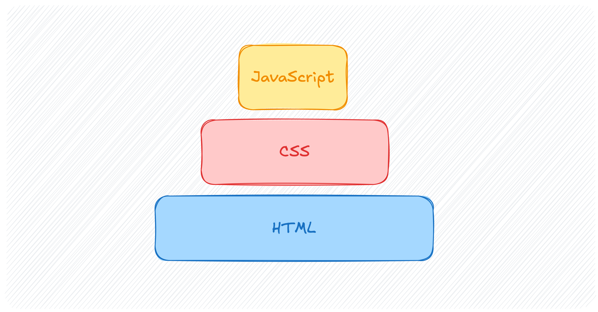

# Amélioration progressive

Des trois langages du web, JavaScript est le moins robuste. 

HTML et CSS sont des langages *déclaratifs*. Ils permettent de déclarer
le *quoi* d'une page web, sans avoir à préciser le *comment*. À l'aide
de balises et de règles, vous décrivez le contenu et l'apparence de
votre site Web, et c'est au navigateur que revient la tâche d'afficher
celui-ci du mieux qu'il peut. En HTML et en CSS, il est impossible de
faire des erreurs de logique.

JavaScript est un langage *impératif*. Il permet de décrire la
*structure de contrôle* d'un programme, c'est-à-dire la suite
d'instructions qui devra être exécutée pour son bon fonctionnement.
Contrairement à un document HTML ou à une feuille de style, un programme
JavaScript qui contient une erreur ne peut pas être exécuté. Si l'erreur
est au milieu du programme, ou bien si le navigateur d'un·e
utilisateur·rice ne supporte pas la même version de JavaScript que vous,
alors le code ne s'exécutera pas. JavaScript est aussi plus couteux à
interpréter que HTML et CSS.

L'amélioration progressive est une manière de concevoir un site Web en
s'appuyant d'abord et avant tout sur la technologie la plus robuste du
Web — le HTML —, et d'améliorer ensuite celui-ci avec, en ordre, des
feuilles de style et des scripts. En séparent strictement le fond
(HTML), la forme (CSS), et les fonctionnalités interactives
(JavaScript), tous et toutes peuvent avoir accès à un *service minimum*,
même si une erreur se glisse dans votre script, ou si vos feuilles de
style sont désactivées.

Implémenter l'amélioration progressive est autant un exercice de
réflexion que de programmation. La première chose à faire est
d'identifier quel service minimum doit offrir chacune de vos pages. Un
formulaire, par exemple, doit, au minimum, permettre aux
utilisateur·rices de soumettre leurs réponses. La soumission doit donc
être possible sans CSS ni JavaScript. Une fois ce service mis en place
de façon robuste, on peut alors l'améliorer en y ajoutant du style et
des fonctionnalités interactives côté client.

En résumé, assurez-vous, d'abord, que ça fonctionne, et, ensuite, que ça
fonctionne mieux. En concevant vos pages web de sorte que les parties
autres que le HTML soient facultatives, vous produirez des sites qui est
plus robustes et accessibles.

